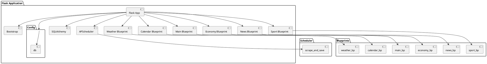

# Aplikacja webowa `news`
Projekt na Inżynierię Oprogramowania, kierunek Nowoczene Technologie w Kryminalistyce, sem. V, grupa II, piątek 11:30.
Projekt na Inżynierię Oprogramowania, kierunek Nowoczene Technologie w Kryminalistyce, sem. V, grupa II, piątek 11:30.

## 📋 Opis projektu
`news` to aplikacja webowa stworzona w Pythonie z wykorzystaniem frameworka **Flask** oraz kaskadowych arkuszy stylów **Bootstrap**. Projekt pokazuje, jak można stworzyć wielomodułową aplikację webową z obsługą zewnętrznego API oraz integracją z bazą danych.

### Cel projektu
Aplikacja tworzona w ramach zajęć z Inżynierii Oprogramowania, ma za zadanie dostarczyć informacje pogodowe, kryminalne i sportowe w prosty i przejrzysty sposób dla użytkowników. System ma umożliwiać także wizualizację historycznych danych pogodowych oraz ekonomicznych. 

### Główne funkcje
- Aplikacja musi wyświetlać temeraturę, opady i ciśnienie dla pięciu lokalizacji
- Użytkownik może przeglądać najnowsze wiadomości kryminalne dla miasta Krakowa
- Aplikacja powinna wyświetlać aktualne kursy walut
- Aplikacja umożliwia wizualizację graficzną danych historycznych o pogodzie i danych ekonomicznych
- Użytkownik może sprawdzić święta, wydarzenia na uczelni oraz imieniny

### Metodologia prowadzenia projektu
Projekt prowadzony jest w metodologi SCRUM. Szczegółowa dokumentacja prowadzenia projektu dostepna jest w [Project Plan](https://aghedupl.sharepoint.com/:x:/r/sites/InynieriaOprogramowaniaGrupaI/Materiay%20z%20zaj/SerwisInformacyjny-1130.xlsx?d=w435e1fcbe69545a09840cb367bf9763f&csf=1&web=1&e=a9bzvh)

## 📐 Architektura Projektu
Aplikacja składa się z trzech głównych warstw

1. Frontend:
   **Opis**: Warstwa frontendowa odpowiada za interfejs użytkownika. Szablony HTML są renderowane przez Flask i mogą korzystać z frameworka CSS Bootstrap.
   **Technologie**: HTML, CSS, Bootstrap, Jinja2.
   **Pliki**: Znajdują się w katalogach modułów, w katalogach templates/ oraz static/.

2. Backend:
   **Opis**: Warstwa backendowa obsługuje logikę aplikacji, przetwarzanie danych oraz komunikację z bazą danych. Flask API obsługuje zapytania HTTP i zarządza trasami.
   **Technologie**: Python, Flask, Flask-APScheduler.
   **Pliki**: Znajdują się w katalogach modułów, w tym routes.py, models.py, config.py.

3. Baza Danych:
   **Opis**: Warstwa bazy danych przechowuje dane aplikacji, takie jak wiadomości, dane pogodowe, kursy walut itp. SQLAlchemy jest używane jako ORM do zarządzania bazą danych.
   **Technologie**: SQLAlchemy, SQLite (lub inna baza danych).
   **Pliki**: Konfiguracja bazy danych znajduje się w config.py.

### Moduły Aplikacji
Aplikacja składa się z nastepujących modułów:
1. Moduł Główny (`main`)
- **Ścieżka** : `/`
- **Opis**: Zawiera główne trasy aplikacji, takie jak strona główna.

2. Moduł Ekonomii (`economy`)
- **Ścieżka**: `/economy`
- **Opis**: Zawiera trasy związane z ekonomią i finansami.

3. Moduł Sportu (`sport`)
- **Ścieżka**: `/sport`
- **Opis**: Zawiera trasy związane ze sportem.

4. Moduł Pogody (`weather`)
- **Ścieżka**: `/weather`
- **Opis**: Zawiera trasy związane z pogodą, w tym aktualne dane pogodowe i prognozy.

5. Moduł Wiadomości (`news`)
- **Ścieżka**: `/news`
- **Opis**: Zawiera trasy związane z wiadomościami i artykułami.

**Diagram Modułów**


### 📦 Struktura katalogów

```
├── app
│   ├── app.py
│   ├── blueprints
│   │   ├── calendar
│   │   │   ├── functions.py
│   │   │   ├── __init__.py
│   │   │   ├── routes.py
│   │   │   └── templates
│   │   │       └── calendar.html
│   │   ├── economy
│   │   │   ├── economyData.py
│   │   │   ├── forms.py
│   │   │   ├── functions.py
│   │   │   ├── routes.py
│   │   │   └── templates
│   │   │       └── economy.html
│   │   ├── __init__.py
│   │   ├── main
│   │   │   ├── routes.py
│   │   │   └── templates
│   │   │       └── main.html
│   │   ├── news
│   │   │   ├── data_scraper.py
│   │   │   ├── models.py
│   │   │   ├── routes.py
│   │   │   └── templates
│   │   │       ├── news.html
│   │   │       ├── news_preview.html
│   │   │       └── single_news.html
│   │   ├── sport
│   │   │   ├── models.py
│   │   │   ├── routes.py
│   │   │   └── templates
│   │   │       ├── articles.html
│   │   │       ├── sport.html
│   │   │       └── sport_preview.html
│   │   └── weather
│   │       ├── __init__.py
│   │       ├── routes.py
│   │       ├── templates
│   │       │   ├── weather2.html
│   │       │   ├── weather.html
│   │       │   └── weather_page.html
│   │       └── weatherService.py
│   ├── config.py
│   ├── data_visualization.py
│   ├── run.py
│   ├── static
│   │   ├── css
│   │   │   ├── calendar.css
│   │   │   ├── main.css
│   │   │   ├── news.css
│   │   │   ├── news_preview.css
│   │   │   ├── single_news.css
│   │   │   └── sport.css
│   │   └── images
│   │       └── favicon.ico
│   ├── templates
│   │   ├── base.html
│   │   └── chart_element.html
│   └── tests
│       ├── calendar_test.py
│       ├── crime_tests.py
│       ├── economy_tests.py
│       ├── graph_test.py
│       ├── __init__.py
│       ├── main_page_test.py
│       ├── pytests.py
│       ├── selenium_main_tests.py
│       ├── selenium_test_graph.py
│       └── weather_test.py
├── docs
│   ├── api.md
│   └── images
│       ├── main.png
│       └── sport_football.png
├── README.md
├── requirements.txt
```

---

### 📊 Wykorzystywane technologie

- **Flask**: Framework do budowy aplikacji webowych.
- **SQLAlchemy**: ORM do zarządzania bazą danych.
- **Jinja2**: System szablonów HTML.
- **Bootstrap**: Framework CSS do stylizacji.
- **APScheduler**: Biblioteka do zarządzania zadaniami w tle.

---

## 🚀 Instalacja i uruchomienie

### 1. Wymagania:
- **Python 3.8+**
- **Pip**
- **Virtualenv** (opcjonalnie, ale zalecane)

### 2. Instalacja:
1. Sklonuj repozytorium:
   ```bash
   git clone https://github.com/TobiaszAGH/news
   cd news
   ```

2. Utwórz i aktywuj wirtualne środowisko:
   Windows
   ```bash
   mkdir venv
   python -m venv venv
   venv\Scripts\activate
   ```
   Linux:
   ```bash
   mkdir venv
   python -m venv venv
   . ./venv/bin/activate
   ```

3. Zainstaluj wymagane zależności:
   ```bash
   pip install -r requirements.txt
   ```
### 3. Uruchomienie aplikacji:
1. Uruchom serwer:
   ```bash
   python .\app\run.py
   ```
2. Otwórz przeglądarkę i przejdź do:
   ```
   http://127.0.1:8000
   ```

---

## ⚙️ Konfiguracja

Aplikacja używa pliku `config.py` do przechowywania ustawień. Przykładowa konfiguracja:
```python
class Config:
    SECRET_KEY = 'your_secret_key'
    SQLALCHEMY_DATABASE_URI = 'sqlite:///app.db'
    SQLALCHEMY_TRACK_MODIFICATIONS = False
```

Jeśli potrzebujesz niestandardowej konfiguracji, utwórz plik `.env` i zdefiniuj zmienne środowiskowe:
```env
SECRET_KEY=your_secret_key
DATABASE_URL=sqlite:///app.db
```

---

## 🛠️ Testowanie
Testy są zorganizowane w katalogu `app/tests/`. 
Dla Aplikacji opracowano testy jednostkowe, integracyjne i akceptacyjne.
Dla testów akceptacyjnych realizowanych z wykorzystaniem Selenium opracowany został plan testowania [Acceptance Test Plan](https://aghedupl-my.sharepoint.com/:x:/g/personal/zsliwa_student_agh_edu_pl/Eena3cdvy9lDpHRhjVNbgDAB6FDhLVo5YigNuNbHCJCe7Q?e=luumll).
Więcej szczegółów znajdziesz w pliku [Testing Documentation](docs/testing.md).

### Uruchomienie testów:
1. Aby uruchomić wszystkie testy wykonaj:
```bash
pytest app\tests\pytests.py
```

2. Aby uruchomić testy jednostkowe, wykonaj:
```bash
pytest app\tests\unit.py
```

3. Aby uruchomić testy integracyjne, wykonaj:
```bash
pytest app\tests\integration.py
```

4. Aby uruchomić testy akceptacyjne, wykonaj:
```bash
pytest app\tests\acceptance.py
```

---

## 📖 API Dokumentacja

### API Zewnętrzne

### API Aplikacji
Szczegółowa dokumentacja API znajduje się w pliku [API Documentation](docs/api.md).

Przykładowy endpoint:

1. Endpoint: `/weather`

**GET /weather**
    - **Opis**: Pobiera aktualne dane pogodowe oraz prognozę dla domyślnego miasta (Kraków) lub miast podanych w formularzu.
    - **Metoda HTTP**: GET
    - **URL**: `/weather`
    - **Parametry**: Brak
    - **Przykład żądania**:
     ```http
    GET /weather HTTP/1.1
    Host: example.com

## 🖼️ Zrzuty ekranu

### Strona główna


### Moduł sportowy

### Moduł ekonomiczny

### Moduł pogodowy

### Moduł ekonomiczny

### Moduł pogodowy

---

## 👥 Autorzy

- **Tobiasz Salik** – Zwierzchnik Młyna, struktura katalogów, moduł ekonomiczny

---

## 📄 Licencja

Projekt jest udostępniony na licencji MIT. Szczegóły znajdziesz w pliku [LICENSE](LICENSE).

---

## ❓ Kontakt

Jeśli masz pytania lub problemy, napisz na:
- E-mail: m.ossysek@agh.edu.pl


Projekt na inżynierię oprogramowania, grupa piątkowa 11:30
